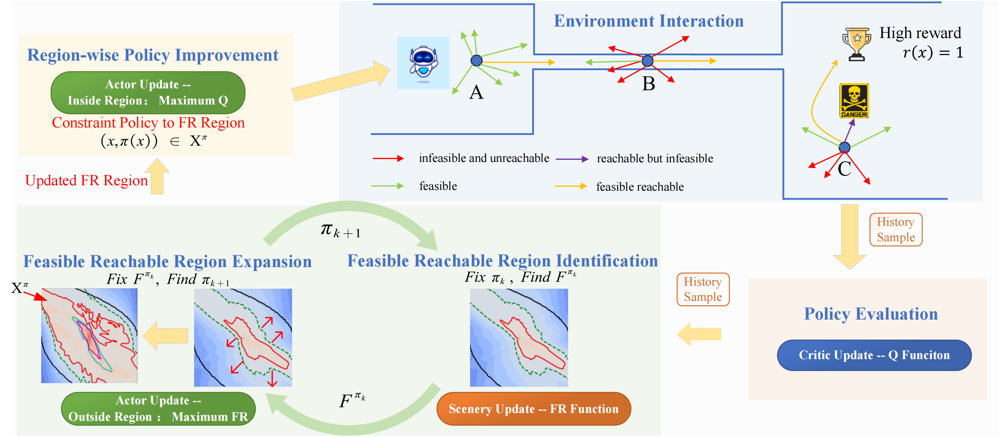


  
You can also find my articles on <a href="{{site.author.googlescholar}}">my Google Scholar profile</a>.






  


# Feasible Reachable Policy Iteration
Shentao Qin\*, Yujie Yang\*, Yao Mu\*, Jie Li, Wenjun Zou, Shengbo Eben Li, Jingliang Duan\
*International Conference on Machine Learning (ICML)*, 2024\
**FRPI is an efficient policy space pruning algorithm of safe reinforcement learning for goal-reaching problems with safety constraints, which achieves the best performance both in safety and return.** 

  

The goal-reaching tasks with safety constraints are common control problems in real world, such as intelligent driving and robot manipulation. The difficulty of this kind of problem comes from the exploration termination caused by safety constraints and the sparse rewards caused by goals. The existing safe RL avoids unsafe exploration by restricting the search space to a feasible region, the essence of which is the pruning of the search space. However, there are still many ineffective explorations in the feasible region because of the ignorance of the goals. Our approach considers both safety and goals; the policy space pruning is achieved by a function called feasible reachable function, which describes whether there is a policy to make the agent safely reach the goals in the finite time domain. This function naturally satisfies the self-consistent condition and the risky Bellman equation, which can be solved by the fixed point iteration method. On this basis, we propose feasible reachable policy iteration (FRPI), which is divided into three steps: policy evaluation, region expansion, and policy improvement. In the region expansion step, by using the information of agent to reach the goals, the convergence of the feasible region is accelerated, and simultaneously a smaller feasible reachable region is identified. The experimental results verify the effectiveness of the proposed FR function in both improving the convergence speed of better or comparable performance without sacrificing safety and identifying a smaller policy space with higher sample efficiency. 
[Download Paper](https://openreview.net/forum?id=ks8qSwkkuZ) |
[Project Page](https://jackqin007.github.io/FRPI/) |
[Code](https://github.com/JackQin007/FRPI) |
[Poster](https://www.researchgate.net/publication/381995027_FRPI_Posterpdf)
